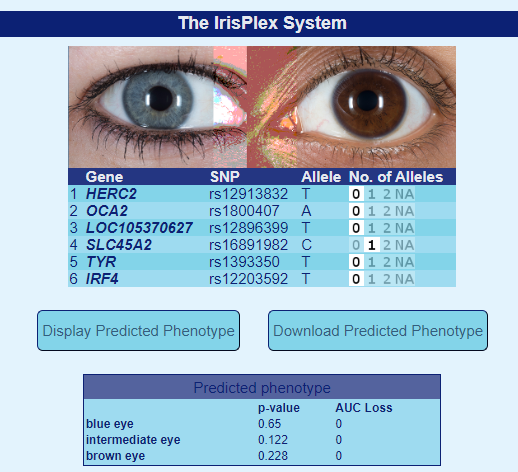
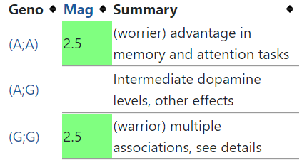
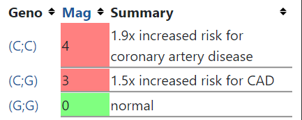
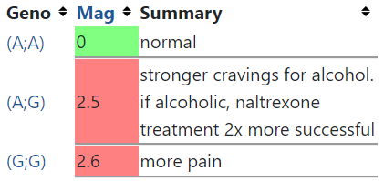

# Отчет
Выбранный пользователь: solarius.   
ID: 9618.  
Link: https://opensnp.org/users/11702

Скачаем данные:
```asm
wget https://opensnp.org/data/11702.23andme.9618
```

### 1)
Выберем нужные SNP:
```asm
grep -w 'rs12913832' 11702.23andme.9618
grep -w 'rs1800407' 11702.23andme.9618
grep -w 'rs12896399' 11702.23andme.9618
grep -w 'rs16891982' 11702.23andme.9618
grep -w 'rs1393350' 11702.23andme.9618
grep -w 'rs12203592' 11702.23andme.9618
```
```asm

rs12913832	15	28365618	AG
rs1800407	15	28230318	CT
rs12896399	14	92773663	GG
rs16891982	5	33951693	CG
rs1393350	11	89011046	AG
rs12203592	6	396321	CC
```

Вносим результат в таблицу:

Наиболее вероятный цвет глаз - голубой.

### 2)
```asm
grep -w 'rs6025' 11702.23andme.9618
grep -w 'rs1799963' 11702.23andme.9618
grep -w 'rs8176719' 11702.23andme.9618
grep -w 'rs2066865' 11702.23andme.9618
grep -w 'rs2036914' 11702.23andme.9618
```
```asm
rs6025	1	169519049	CC
rs1799963	11	46761055	GG
rs8176719	9	136132908	TT
rs2066865	4	155525276	GG
rs2036914	4	187192481	TT
```
Материалы:  
https://www.ebi.ac.uk/gwas/variants/rs2036914
https://www.snpedia.com/index.php/Rs1799963
https://www.snpedia.com/index.php/Rs6025
https://www.ebi.ac.uk/gwas/variants/rs8176719
https://www.ebi.ac.uk/gwas/variants/rs2066865

Рискованные генотипы:  
rs6025 - AA, AG  
rs2036914 - CC  
rs1799963 - AA, AG  
rs8176719 - GG  
rs2066865 - AA  
У solarius нет рискованных генотипов.


### 3) rs4680
https://www.snpedia.com/index.php/Rs4680
Влияет на расщепление дофамина в префронтальной коре головного мозга, что влияет на различные когнитивные характеристики.
```asm
grep -w 'rs4680' 11702.23andme.9618
```
```asm
rs4680	22	19951271	GG
```
  
Для solarius более вероятны характеристики: более низкий уровень дофамина; более высокий болевой порог, лучшая стрессоустойчивость, хотя и со скромным снижением эффективности когнитивных функций в большинстве условий.

### 4) rs1333049
https://www.snpedia.com/index.php/Rs1333049  
Ассоциирован с заболеваниями сердца, в частности коронарной недостаточностью.
```asm
grep -w 'rs1333049' 11702.23andme.9618
```
```asm
rs1333049	9	22125503	CG
```
  
У solarius в 1.5 раза повышен риск коронарной недостаточности.

### 5) rs1799971
https://www.snpedia.com/index.php/Rs1799971  
Ассоциирован с более сильной тягой к алкоголю.
```asm
grep -w 'rs1799971' 11702.23andme.9618
```
```asm
rs1799971	6	154360797	AG
```
  
Если бы solarius был алкоголиком, его зависимость была бы сравнительно сильнее, чем у людей с AA.
