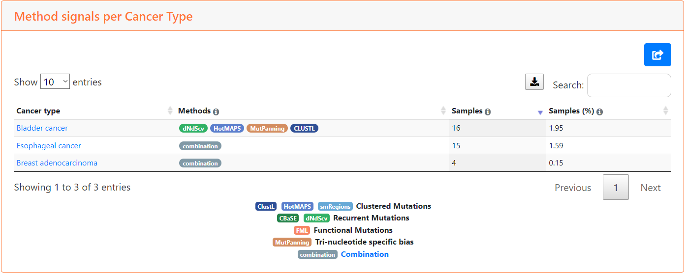
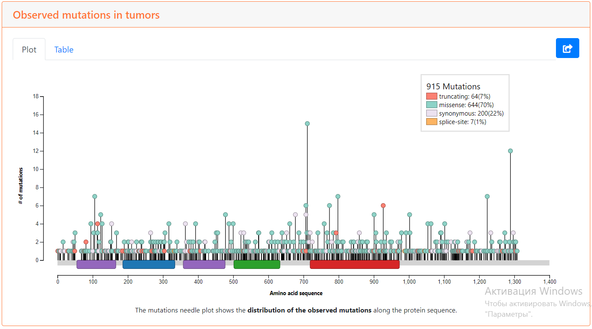
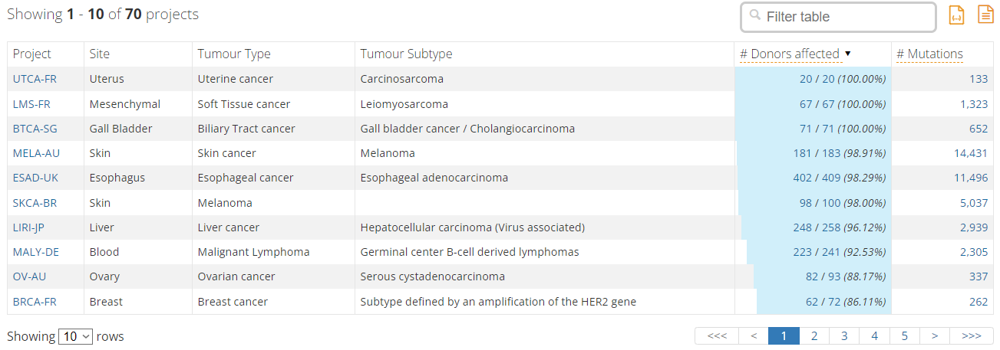
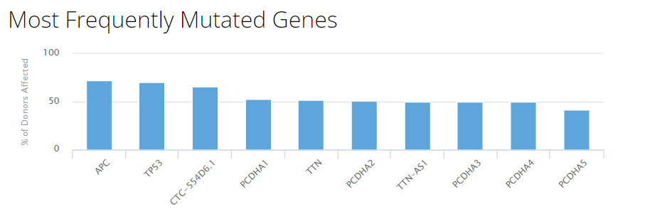

# Отчет
Выбранный ген: ERBB4  
IntOGen: https://www.intogen.org/search?gene=ERBB4  
ICGC: https://dcc.icgc.org/genes/ENSG00000178568
  
Выбранный донор: DO36945  
ICGC: https://dcc.icgc.org/donors/DO36945  

## Часть первая

### 1)
На странице IntOGen находим таблицу с типами рака, в которых ген мутировал, и график наблюдаемых мутаций.  
  
  
ERBB4 мутировал в 3 типах рака - рак мочевого пузыря (bladder cancer), рак пищевода (esophageal cancer), аденокарценома молочной железы (breast adenocarcinoma).  
92% мутаций точечные (missence & synonimous), 8% структурные (truncating & split-site).

### 2)
На странице гена в ICGC в разделе Mutations приведена таблица исследований, в которых были обнаружены мутации ERBB4. Всего типов рака, в которых он мутировал, 70. Все типы в таблице ENSG00000178568_distribution_2023_03_22_09_23_06.tsv  
На скриншоте первые 10 строк таблицы.  
 

## Часть вторая
Со страницы донора скачиваем таблицу с одноточечными мутациями - DO36945.tsv  
Ищем вхождения Ensembl гена - ENSG00000178568 - в таблице:
  
```asm
grep -wc 'ENSG00000178568' DO36945.tsv
```
```
0
```
Т.о. мутаций в ERBB4 у данного пациента нет.  

DO36945 участвовал в исследовании , рассматривающем аденокарциному прямой кишки (Rectum Adenocarcinoma). В разделе Mutations можно найти наиболее часто мутирующие гены:  
  
  
Рассмотрим топ-4 гена:  

APC - ENSG00000134982  
TP53 - ENSG00000141510  
CTC-554D6.1 - ENSG00000258864  
PCDHA1 - ENSG00000204970

```asm
grep -wc 'ENSG00000134982' DO36945.tsv
grep -wc 'ENSG00000141510' DO36945.tsv
grep -wc 'ENSG00000258864' DO36945.tsv
grep -wc 'ENSG00000204970' DO36945.tsv
```  
```
32
34
2
4
```  
Во всех приведенных генах у пациента наблюдаются мутации.