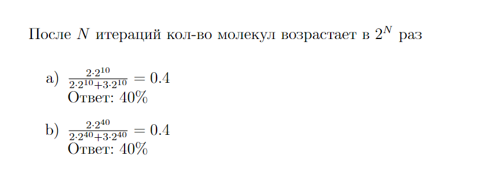
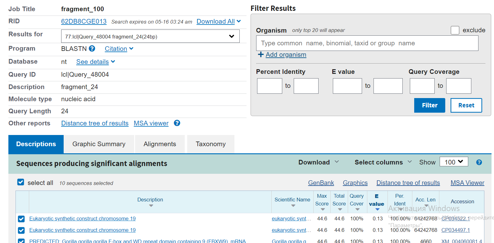
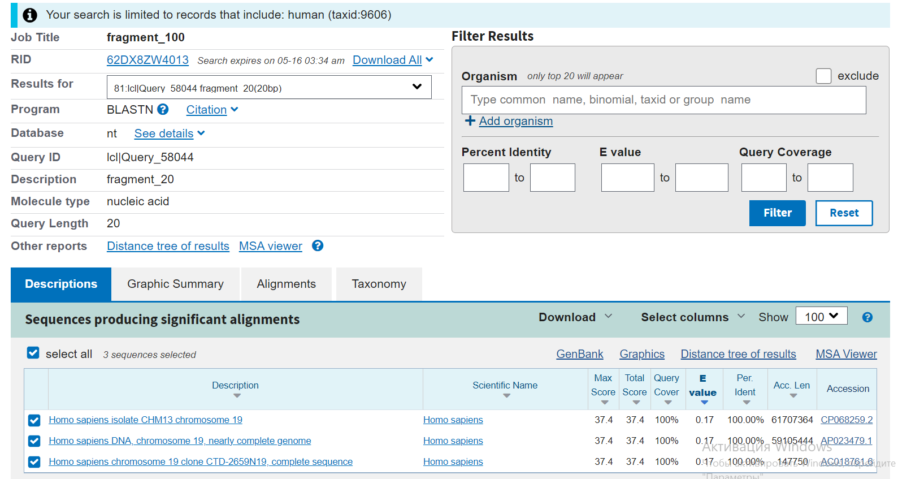

# Отчет

## Часть первая

### Задание 1:
[Директория](proteins): в каждой папке .fasta файл с белком человека и его ортологом у шимпанзе, их выравнивание и скрин с identities и similarity (positives)  
Сводная таблица:  
| Human Protein | Pan Troglodytes Protein | Identity | Similarity |
|---------------|-------------------------|----------|------------|
| ECD_HUMAN     | A0A2I3RSG0_PANTR        | 99%      | 99%        |
| BRCA1_HUMAN   | BRCA1_PANTR             | 98%      | 98%        |
| TPMT_HUMAN    | TPMT_PANTR              | 99%      | 99%        |
| APOE_HUMAN    | APOE_PANTR              | 97%      | 98%        |
| ACTB_HUMAN    | ACTB_PANTR              | 100%     | 100%       |
| HELZ_HUMAN    | H2QDQ4_PANTR            | 99%      | 99%        |
| PML_HUMAN     | H2Q9S3_PANTR            | 91%      | 91%        |
| HBB_HUMAN     | HBB_PANTR               | 100%     | 100%       |
| HSPB1_HUMAN   | H2QUT1_PANTR            | 100%     | 100%       |
| MYH7_HUMAN    | A0A2I3SXF0_PANTR        | 99%      | 99%        | 

Среднее identity: 98.2%  
Среднее similarity: 98.3%

### Задание 2:

## Часть вторая
### Задание 1:
#### Вопрос 0:
  
#### Вопрос 1 + 2:
Загружаем [30.fasta](resources/30.fasta) в BLAST, для каждого рида смотрим лучший матч, у которого identity >= 99%. Для таких видов записываем description, в котором указан вид. [Результат](resources/reads.txt).  
В чтениях присутствуют виды:
| Вид                    | Доля |
|------------------------|------|
| Canis lupus familiaris | 26%  |
| Homo sapiens           | 13%  |
| Lutra lutra            | 1%   |
| Mus musculus           | 47%  |
| NaN                    | 13%  |  

Таким образом виновник загрязнения Иванов, т.к. есть процент загрязнения от Canis lupus familiaris, и нет ни одного рида, классифицированного как Felis catus.  
По доле каждого вида, можно сделать вывод, что есть загрязнение от собаки и человека. Выдра (Lutra lutra) это, вероятно, выброс.

### Задание 2:
#### a)
[Скрипт](resources/cut-sequence.py), производящий [обрезанные последовательности](resources/cut-sequences.fasta)  
Для последовательностей длины 24 и меньше E-value > 0.05  

#### b)
Если ограничить область поиска человеком, то E-value превышает 0.05 уже только для последовательностей длины 20 и меньше  
  
E-value показывает вероятность случайного совпадения. Соответственно, если мы рассматриваем геном человека и сужаем область поиска до человека, мы исключаем случайные совпадения с другими видами, поэтому для последовательностей одинаковой длины E-value уменьшается.